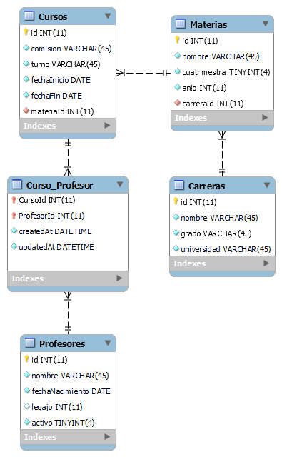

[](https://classroom.github.com/a/wCJ4UtrS)
# Estrategias de Persistencia - TP 2024

Trabajo Práctico N°1 de Estrategias de Persistencia.

Grupo: No sé centrar un DIV.

## Diagrama Entidad-Relación



## Base de datos
El motor de base de datos que utilizamos para este trabajo es SQlite, por cuestión de comodidad y para no complicarnos mucho. Igualmente si se desea cambiar el motor es tan sencillo como editar el archivo config.json ubicado en la ruta /src/db/config.

## Comandos para la instalación de las dependencias y ejecutar la API:

```npm i ```

```npm run dev``` 